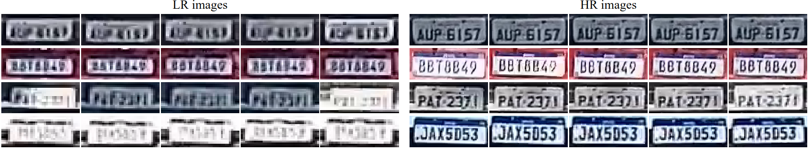

# UFPR-SR-Plates Dataset

This dataset contains **100,000 license plate (LP) images** organized into **10,000 tracks**, captured under real-world surveillance conditions. Each track includes **five sequential low-resolution (LR)** images (captured when the vehicle was farthest from the camera) and **five sequential high-resolution (HR)** images (captured at the vehicle's closest point). The dataset is designed to advance research in license plate super-resolution (SR) and recognition (LPR) under challenging real-world conditions.

## Key Features
- **Real-world diversity**: Images were captured under varying lighting, weather, and environmental conditions using a rolling shutter camera installed on a Brazilian road.
- **Two LP layouts**: Balanced distribution between Brazilian (3 letters + 4 digits) and Mercosur (3 letters + 1 digit + 1 letter + 2 digits) license plates.
- **Two image resolutions**: 
  - 5,000 tracks captured at **1280×960 pixels**
  - 5,000 tracks captured at **1920×1080 pixels**
- **Temporal information**: Multiple LR/HR images per vehicle, enabling exploration of temporal fusion strategies.
- **Annotations**: JSON files with LP corner coordinates, LP layout, and ground-truth text for all images.
- **Privacy-compliant**: LPs from vehicles registered in Brazil are not linked to personal data, adhering to local regulations.

  
*Examples of tracks from the UFPR-SR-Plates dataset. Each track comprises five consecutive LR images and five consecutive HR images of the
same LP, captured under varying conditions. Each row shows a single track, with the LR images displayed on the left and the corresponding HR images on
the right. We remark that even what we consider ‘HR’ in the context of this work is of lower quality than the datasets typically used in LPR research.*

## Dataset Structure
- **Total tracks**: 10,000 (5,000 per resolution)
- **Total images**: 100,000 (50,000 LR + 50,000 HR)
- **Split** (per resolution):
  - Training: 40%
  - Validation: 20%
  - Test: 40%
    
  *Each LP appears in only one split.*

## How to obtain the dataset
The UFPR-SR-Plates dataset is released for academic research only and is free to researchers from educational or research institutes for **non-commercial purposes**.

To be able to download the dataset, please read carefully this license agreement, fill it out and send it back to Professor David Menotti (menotti@inf.ufpr.br). **Your e-mail must be sent from a valid university account** (.edu, .ac or similar).

In general, you will receive a download link within 1-5 business days. If you do not receive it within this timeframe, please check your spam/junk folder. Failure to follow the instructions above may result in no response.

## Citation
If you use the UFPR-SR-Plates dataset in your research, please cite our paper:

* V. Nascimento, G. E. Lima, R. O. Ribeiro, W. R. Schwartz, R. Laroca, D. Menotti, “Toward Advancing License Plate Super-Resolution in Real-World Scenarios: A Dataset and Benchmark,” Journal of the Brazilian Computer Society, pp. 1-14, 2025.

```bibtex
@article{nascimento2025toward,
  title = {Toward Advancing License Plate Super-Resolution in Real-World Scenarios: A Dataset and Benchmark},
  author = {V. {Nascimento} and G. E. {Lima} and R. O. {Ribeiro} and W. R. {Schwartz} and R. {Laroca} and D. {Menotti}},
  year = {2025},
  journal = {Journal of the Brazilian Computer Society},
  volume = {},
  number = {},
  pages = {1-14},
  doi = {},
  issn = {},
}
```

Additionally, consider showing your support by **starring** :star: this repository.

## Related Publications
Explore our other works on license plate recognition and super-resolution:
- [Combining Attention Module and Pixel Shuffle for License Plate Super-resolution (SIBGRAPI 2022)](https://ieeexplore.ieee.org/document/9991753)
- [Super-Resolution of License Plate Images Using Attention Modules and Sub-Pixel Convolution Layers (Computers & Graphics 2023)](https://www.sciencedirect.com/science/article/pii/S0097849323000602?via%3Dihub)
- [Full list of publications on vehicle identification](https://scholar.google.com/scholar?hl=pt-BR&as_sdt=0%2C5&as_ylo=2018&q=allintitle%3A+plate+OR+license+OR+vehicle+author%3A%22David+Menotti%22&btnG=)

## Contact
For questions or feedback, contact:

**Valfride Wallace do Nascimento** [[Webpage](https://www.inf.ufpr.br/vwnascimento/)]

[vwnascimento@inf.ufpr.br](mailto:email@example.com)
